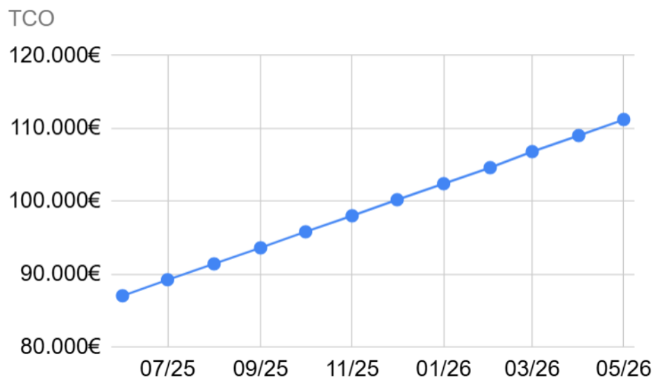

# 
Título del Documento

## 
Ingeniería del Software y Práctica Profesional (ISPP)

### Grupo 3: EventBride

### Miembros:
- Francisco Avilés Carrera
- Daniel Benito Hidalgo
- Ignacio Blanquero Blanco
- Adrián Cabello Martín
- María de la Salud Carrera Talaverón
- Pablo Jesús Castellanos Compaña
- Fernando José de Celis Hurtado
- David Godoy Fernández
- Miguel Hernández Sánchez
- Antonio Montero López
- Gonzalo Navas Remmers
- Héctor Noguera González
- Natalia Olmo Villegas
- Manuel Pérez Vélez
- Andrés Pizzano Cerrillos
- Sergio Pons López
- Lorenzo Torralba Lanzas

### Fecha: 10/03/2025
### Entregable: Sprint 1

---

### Historial de versiones

|Fecha|Versión|Descripción|Entrega|
|---|---|---|---|
|05/02/2025|v1.0|Creación del documento| DP |
|11/02/2025|v1.1|Corrección del feddback 1| DP |
|16/02/2025|v1.2|Corrección del feddback 2| DP |
|19/02/2025|v1.3|Corrección del feddback 3| DP |
|10/03/2025|v1.4|Paso del formato a Markdown| Sprint 1 |

## Contenido
1. [Resumen](#resumen)
2. [Introducción](#intro)
    1. [Costes de Desarrollo](#id21)
    2. [Costes de Infraestructura y Licencias](#id22)
    3. [Coste Inicial Total](#id23)
3. [Costes de mantenimiento](#id3)
4. [TCO](#id4)
    1. [Costes de recompensa de Usuarios Piloto](#id41)
5. [Bibliografía](#bib)

## Resumen

El documento detalla de manera exhaustiva todos los costes asociados a la aplicación. En primer  lugar,  se  presentan  los costes  de  desarrollo,  que  incluyen  los  salarios  de  los empleados, alcanzando un total de **74.400,00 €** durante los cuatro meses de desarrollo. 

A continuación, se describen los costes de infraestructuras y licencias, entre los que se incluyen el despliegue en **Google  Cloud**, con un coste estimado de **320’00  €/mes**, así como los servicios de **GitHub Enterprise** y **GitHub Copilot**. Adicionalmente, se contempla el  alquiler  de  oficina,  cuyo  coste  asciende  a  **450’00  €/mes**.  En  total,  los  costes  de infraestructuras y licencias suman **5.930’40 €** en el período de desarrollo.

Considerando tanto los costes de desarrollo como los de infraestructuras y licencias, y añadiendo un  **10 %** destinado a un plan de contingencia, el coste total estimado asciende a aproximadamente **90.000’00 €**. 

Posteriormente,  se  abordan  los  costes  de  mantenimiento,  los  cuales  incluyen  las infraestructuras y licencias previamente mencionadas, además del salario de dos técnicos de soporte. El coste mensual de mantenimiento se estima en **2.200’00 €**. Además, se habla de los gastos de la API de Stripe y de la posibilidad de adquirir el plan Enterprise. 

Por último, se han estimado **4.300’00 €** destinados a recompensas para los usuarios piloto, además de un descuento en la comisión aplicable a aquellos que deseen organizar un evento a través de la plataforma. 

## Introducción

Este documento presenta una estimación detallada de los costos previstos por el equipo del proyecto para el desarrollo de la aplicación EventBride dentro del período de cuatro meses correspondiente a la asignatura Ingeniería de Software y Práctica Profesional (ISPP). Asimismo, se describen las distintas categorías de costos y se analizan los beneficios 
esperados con el objetivo de amortizar el Costo Total de Propiedad (TCO)

## Costes de Desarrollo

| **Id** | **Rol**                | **HSM**    | **Cantidad** | **Horas** | **Total**   |
|--------|------------------------|------------|--------------|-----------|-------------|
| **Dirección del proyecto** |            |            |              |           |             |
| 1.0    | Jefe de proyecto       | 40'00 €    | 1            | 160       | 6.400'00 €  |
| **Jefes de Subequipos**    |            |            |              |           |             |
| 1.1    | Jefe de subequipo 1     | 30'00 €    | 1            | 160       | 4.800'00 €  |
| 1.2    | Jefe de subequipo 2     | 30'00 €    | 1            | 160       | 4.800'00 €  |
| 1.3    | Jefe de subequipo 3     | 30'00 €    | 1            | 160       | 4.800'00 €  |
| **Desarrollo**             |            |            |              |           |             |
| 1.4    | Programador Web        | 20'00 €    | 9            | 160       | 28.800'00 € |
| 1.5    | Analista Programador web        | 30'00 €    | 2            | 160       | 9.600'00 € |
| 1.6    | Diseñador gráfico      | 30'00 €    | 2            | 160       | 9.600'00 € |

**Tabla 2.1. Costes de desarrollo**

Los costes de desarrollo corresponden a la inversión total en recursos humanos requerida 
para la ejecución del proyecto. Como se detalla en la **Tabla 2.1**, cada recurso se encuentra 
definido por un rol específico, asociado a una **Hora  de  Servicio  Mínima  (HSM)** [1](#bibliografía). El 
equipo del proyecto se estructura en función de estos roles y desempeña sus actividades 
con una dedicación de **10 horas semanales** a lo largo de **16 semanas**.

## Costes de Infraestructura y Licencias

| **Id** | **Servicio**           | **Precio/mes** | **Cantidad** | **Meses** | **Total**     |
|--------|------------------------|----------------|--------------|-----------|---------------|
| 2.1    | Google Cloud           | 315’31 €       | 1            | 4         | 1.261’24 €    |
| 2.2    | GitHub Enterprise      | 20’01 €        | 17           | 4         | 1.360’68 €    |
| 2.3    | GitHub Copilot         | 9’53 €         | 17           | 4         | 648’04 €      |
| 2.4    | Codacy                 | 14’29 €        | 1            | 4         | 57’16 €       |
| 2.5    | API Google Maps        | 200’07 €       | 1            | 4         | 800’28 €      |
| 2.7    | Oficina                | 450’00 €       | 1            | 4         | 1.800’00 €    |

**Tabla 2.2. Costes de Infraestructuras y Licencias**

Los costes de infraestructura comprenden la suma de los pagos mensuales por el alquiler 
de oficina, mientras que los costes de licencias corresponden al inmovilizado inmaterial 
del proyecto. Ambos se encuentran definidos exclusivamente para la etapa de desarrollo 
(véase **Tabla 2.2**).

A  continuación,  se  detallan  los  costes  mensuales  asociados  a  los  distintos  servicios 
utilizados: 
- **Google Cloud: 315,31 €** [2](#bibliografía), correspondiente a dos instancias de App Engine y una 
instancia de Cloud SQL. 
- **GitHub Enterprise: 20,01 €** por usuario al mes [3](#bibliografía). 
- **GitHub Copilot: 9,53 €** por usuario al mes [4](#bibliografía). 
- **Codacy: 14,29 €** al mes [5](#bibliografía). 
- **API  de  Google  Maps: 200,07  €**, estimado para un volumen mensual de 30.000 
solicitudes y 1.000 usuarios diarios, con un coste de 0,007 $ por consulta [6](#bibliografía). 
- **Alquiler de oficina en Sevilla Este: 450,00 €** al mes [7](#bibliografía).

## Coste Inicial Total

El coste inicial total (CI) es la suma de los costes de desarrollo, los costes de seguridad 
social de los trabajadores y los costes de infraestructuras y licencias. Considerando un 
plan de consistencia del 10%, el CI asciende a 82.200’14€.

## Costes de mantenimiento

| **Id** | **Servicio**           | **Precio mensual** | **Cantidad** | **Meses** | **Total**     |
|--------|------------------------|--------------------|--------------|-----------|---------------|
| 3.1    | Técnico de soporte     | 800’00 €           | 2            | 1         | 1.600’00 €    |
| 3.2    | Google Cloud           | 315’31 €           | 1            | 1         | 315’31 €      |
| 3.3    | GitHub Enterprise      | 20’01 €            | 3            | 1         | 60’03 €       |
| 3.4    | GitHub Copilot         | 9’53 €             | 3            | 1         | 28’59 €       |
| 3.5    | Codacy                 | 14’29 €            | 1            | 1         | 14’29 €       |
| 3.6    | API Google Maps        | 200’07 €           | 1            | 1         | 200’07 €      |

**Tabla 3.1. Costes de Mantenimiento Mensuales**

Los costes de mantenimiento (MRO) comprenden los gastos asociados al personal y a las licencias necesarias para garantizar el funcionamiento de la aplicación durante un año tras la finalización de la fase de desarrollo. 

En relación con la Tabla 3, los costes mensuales se calculan de la misma manera que en las Tablas 2.1 y 2.2. No obstante, es importante destacar que la Hora de Servicio Mínima (HSM)  de  un  técnico  de  soporte  se  establece  en  20,00  €.  Dado  que  cada  técnico desempeñará una jornada de 40 horas mensuales durante 12 meses, el coste mensual por 
cada perfil asignado asciende a 800,00 €.

| **Id** | **Rol**               | **HSM**    | **Cantidad** | **Horas** | **Total**     |
|--------|-----------------------|------------|--------------|-----------|---------------|
| 4.1    | Técnico de soporte    | 20’00 €    | 2            | 40        | 1.600’00 €    |

**Tabla 3.2. Sueldo Mensual de Mantenimiento**

## TCO

El  Coste  Total  de  Propiedad  (Total  Cost  of  Ownership,  TCO)  proporciona  un  resumen 
detallado de los costes estimados en los apartados anteriores, compuesto por la suma del 
Coste Inicial (CI) y los Costes de Mantenimiento (MRO). 

A  partir  del  análisis  de  costes  [8](#bibliografía),  se  ha  determinado  que,  para  cubrir  los  gastos  de desarrollo, será necesario alcanzar entre 74 y 111 transacciones dentro de la aplicación 
(relacionadas con la organización de eventos). Adicionalmente, una vez finalizada la etapa de  desarrollo,  se  ha  estimado que  el  coste  de mantenimiento  asciende  a  2.218’29 € mensuales, lo que implica que serían necesarios entre 2 y 3 pagos mensuales para cubrir dicho importe. 

Cabe destacar que estos cálculos han sido realizados sin considerar las **suscripciones premium** de los proveedores. Además, deberíamos añadir los costes de la API de Stripe, que tiene un coste de comisión de un 1’5% + 0.25€ por cada transacción dentro de la unión europea  y  España,  y  de  2’9%  +  0.25€  con  el  pago  de  tarjetas  internacionales  [9](#bibliografía). 
Posteriormente  se  hará  un  análisis  de  los  gastos  de  la  API  de  Stripe  y  se  decidirá  la posibilidad de adquirir el plan Enterprise el cual funciona de forma de pago mensual en vez de mediante comisiones.

**Gráfica de TCO**

## Costes de recompensa de Usuarios Piloto

| **Id** | **Rol**                    | **Precio/mes** | **Cantidad** | **Meses** | **Total**     |
|--------|----------------------------|----------------|--------------|-----------|---------------|
| 5.1    | Usuario Piloto Proveedor    | 90€            | 8            | 6         | 4.320’00 €    |

**Tabla 4.1 Costes de Recompensa Usuarios Piloto**

Dado nuestro programa de usuarios piloto, a los proveedores que se le proporcione nuestra aplicación a modo de prueba, recibirán de manera gratuita la aplicación con la suscripción premium durante medio año. Además, a los usuarios pilotos organizadores de eventos se les quitará la comisión al realizar el pago.

## Bibliografía

[1]: [Perfiles profesionales ámbito informático](https://www.juntadeandalucia.es/haciendayadministracionpublica/apl/pdc_sirec/perfiles-licitaciones/consultas-preliminares/detalle.jsf?idExpediente=000000078484)

[2]: [Google Cloud Calculator](https://cloud.google.com/products/calculator?dl=CjhDaVEwTlROa1pHTTNNeTFrTjJaakxUUXdaREV0T1Rka015MWtaamN5T0RJMFpqTm1aamtRQVE9PRAMGiQ3QTkxQTE4NC1CRDQ2LTRDMjctODRCNS01Mzc4QUY0MjI4Mzk)

[3]:[GitHub Enterprise](https://github.com/pricing) 

[4]:[GitHub Copilot](https://github.com/features/copilot#pricing)

[5]:[Codacy sistema de precios](https://www.codacy.com/pricing)

[6]:[API Google Maps](https://developers.google.com/maps/billing-and-pricing/pricing?hl=es-419#dynamic-maps)

[7]:

[8]:[Excel con análisis de costes](https://uses0-my.sharepoint.com/:x:/g/personal/natolmvil_alum_us_es/EdS2Oo4PIGlKjVsFuRwkQ88BqyNE2jOEUUfDKJVEhNV2-w?e=7flSGJ)

[9]:[Pricing Stripe](https://stripe.com/es/pricing)
 
 
 
