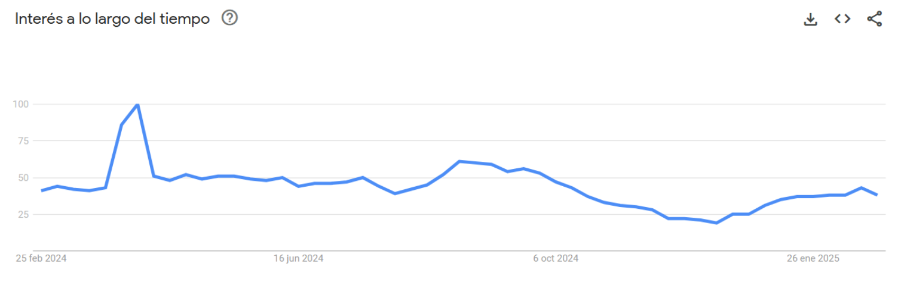
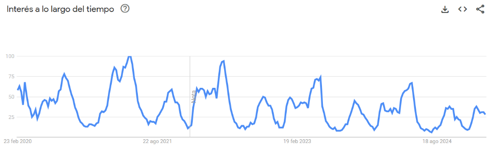
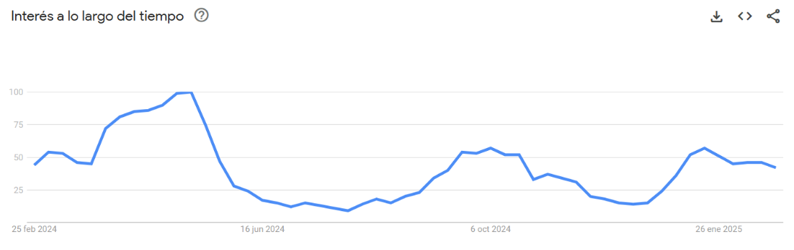
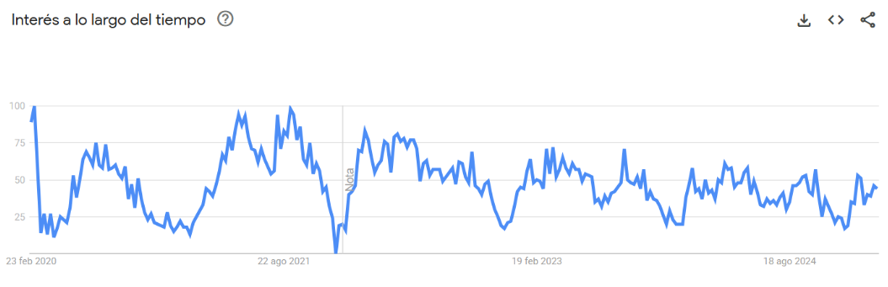

# 
Título del Documento

## 
Ingeniería del Software y Práctica Profesional (ISPP)

### Grupo 3: EventBride

### Miembros:
- Francisco Avilés Carrera
- Daniel Benito Hidalgo
- Ignacio Blanquero Blanco
- Adrián Cabello Martín
- María de la Salud Carrera Talaverón
- Pablo Jesús Castellanos Compaña
- Fernando José de Celis Hurtado
- David Godoy Fernández
- Miguel Hernández Sánchez
- Antonio Montero López
- Gonzalo Navas Remmers
- Héctor Noguera González
- Natalia Olmo Villegas
- Manuel Pérez Vélez
- Andrés Pizzano Cerrillos
- Sergio Pons López
- Lorenzo Torralba Lanzas

### Fecha: 12/03/2025

### Entregable: Sprint 1

---

### Historial de versiones

|Fecha|Versión|Descripción|Entrega| Contribuyente(s) |
|---|---|---|---|---|
|24/02/2025 |v1.0|Primera Instancia del análisis de mercado| DP |Fernando José de Celis Hurtado, Antonio Montero López, Miguel Hernández Sánchez y Pablo Jesús Castellanos Compaña|
|10/03/2025 |v2.0 |Introducción | Sprint 1 |María de la Salud Carrera Talaverón|
|10/03/2025 |v2.1 |Pasar a formato Markdown | Sprint 1 | Daniel Benito Hidalgo|
|12/03/2025 |v2.2 |Adición de información requerida en la plantilla | Sprint 1 |María de la Salud Carrera Talaverón|

## Contenido
1. [Introducción](#intro)
2. [Análisis de mercado](#id1)
    1. [Tamaño de mercado](#id21)
    2. [Demanada de Herrramientas digitales](#id22)
    3. [Tendencias en sector de eventos](#id23)
    4. [Tendencias de busqueda en internet](#id24)
4. [Conclusiones](#concl)
5. [Bibliografía](#bib)

## Introducción

Este documento presenta un análisis de mercado enfocado en el sector de eventos sociales, con especial atención a las tendencias actuales y la viabilidad de una aplicación que facilite la planificación de celebraciones de bodas, bautizos y comuniones. A través del estudio del tamaño del mercado, la demanda de soluciones digitales y el comportamiento de búsqueda en internet, se identifican oportunidades clave para el desarrollo de una plataforma que responda a las necesidades de los usuarios.

El análisis abarca datos relevantes sobre la industria de bodas, bautizos y comuniones en España, explorando factores como la estacionalidad de estos eventos, las tendencias de personalización y la evolución del interés en herramientas digitales de gestión. Además, se examinan las búsquedas en línea para evaluar el interés del público y la sostenibilidad del mercado a largo plazo.

Con esta investigación, se busca ofrecer una visión detallada del panorama actual y respaldar la toma de decisiones estratégicas en el desarrollo de una solución digital innovadora para la organización de eventos.

## Análisis de mercado

### Tamaño del mercado

**Bodas**:

En 2023, se celebraron **172.430 matrimonios** en España, de los cuales el **82,3%** fueron civiles y el **17,7%** religiosos. Aunque las bodas religiosas han disminuido, el número total de bodas sigue siendo significativo. No hay datos específicos para la provincia de Sevilla, pero se estima que tiene la misma tendencia que en el país.

**Bautizos y comuniones**:

En 2023, se registraron **152.426 bautizos** y **162.580 primeras comuniones**, lo que representa una disminución respecto al año anterior. De nuevo no hay datos específicos para la provincia, pero se estima la misma tendencia aproximadamente.

---

### Demanda de herramientas digitales

**Necesidades de los usuarios**:

Las familias que organizan eventos religiosos pueden enfrentar desafíos en la coordinación de múltiples aspectos, como la selección de proveedores (catering, fotografía, música), gestión de invitados y seguimiento de fechas clave. Una aplicación que centralice y facilite estas tareas podría ser bien recibida.

**Tendencias tecnológicas**:

La digitalización en la organización de eventos está en aumento. Herramientas que ofrecen gestión de calendarios, reservas en línea y comunicación directa con proveedores están ganando popularidad, lo que indica una oportunidad para una aplicación enfocada en eventos religiosos.

---

### Tendencias en el sector de eventos

**Personalización de eventos**:

Existe una creciente demanda por experiencias únicas y personalizadas en eventos, donde las familias buscan incorporar elementos distintivos que reflejen sus valores y tradiciones.

**Bodas**:

La estación perfecta para celebrar una boda en Sevilla es la primavera (desde finales de marzo a principios de junio) o los inicios del otoño (finales de septiembre y octubre), hace un tiempo espléndido, con un calor agradable y sin ningún atisbo de lluvias que puedan dificultar el transcurso de la velada.

**Comuniones**:

Las comuniones en Sevilla y en otros países católicos suelen celebrarse entre los meses de abril, mayo y junio, coincidiendo con la temporada de Pascua. Esto se debe a que, según la tradición cristiana, las comuniones deben tener lugar después de la Semana Santa y durante el tiempo pascual. Los periodos más solicitados son los siguientes:

- **Última semana de abril**: Algunas parroquias inician las comuniones el fin de semana del 26-27 de abril.
- **Mes de mayo**: Tradicionalmente, los fines de semana de mayo (3-4, 10-11, 17-18, 24-25) son los más solicitados.
- **Junio**: En algunas localidades, especialmente en parroquias con alta demanda, las comuniones pueden extenderse hasta junio, siendo los primeros fines de semana los más habituales.

**Bautizos**:

Los meses ideales para bautizar a un bebé son **abril, mayo, septiembre y octubre**. Estas opciones no son arbitrarias; al contrario, se consideran óptimas porque combinan un clima agradable, menos probabilidades de extremos de calor o frío y, en general, una mayor disponibilidad de fechas en iglesias y salones para la recepción.

- **Clima perfecto para el bebé**: Las temperaturas son moderadas, lo cual es importante para que el bebé esté cómodo.
- **Decoración floral natural**: La primavera está llena de flores naturales y un ambiente lleno de vida.
- **Facilidad para celebraciones al aire libre**: Abril y mayo permiten aprovechar jardines y espacios abiertos.

---

### Tendencias de búsqueda en internet

Gracias a la herramienta **Google Trends** podemos saber la frecuencia de búsqueda de palabras clave que nos interesan a la hora de intentar posicionar nuestra aplicación.

**Término “boda”**:

Como se puede observar, en los últimos 5 años, el término bodas se busca frecuentemente a lo largo de todo el año con una media de 100 búsquedas al día. Esto garantiza el futuro de la aplicación a largo plazo al ser algo que no pasa de moda. 

En este gráfico se puede ver la búsqueda del término bodas a lo largo del año. También se observa un uso constante por parte de los usuarios así que se puede decir que podría haber un flujo constante de nuevos usuarios en la app. Por último, hay un pico entre los meses de marzo y abril, que coincide a las fechas donde se producen mayores bodas y, por el contrario, una bajada en el mes de diciembre. 

#### Término “comunión”:

Como se puede observar en el gráfico de 5 años, es un término que tampoco sigue modas. Sin embargo, tiene una época más marcada.

En el gráfico ampliado de los últimos 12 meses, se puede observar que en los meses de marzo, abril y mayo es el máximo, ya que es cuando se producen. En verano hay un valle hasta septiembre y octubre, y luego repunta en enero.

#### Término “bautizo”:

En cuanto a las búsquedas de bautizos en los últimos 5 años, se puede observar una bajada no pronunciada reciente. Esto se puede deber a un posible decrecimiento de la natalidad o la fe cristiana.  

No se produce mucha variación de la búsqueda a lo largo de un año del término. Podemos asumir que se buscará a lo largo del año de forma homogénea.

---

## Conclusiones

Se puede decir que la demanda de bodas, bautizos y comuniones es constante. Los bautizos y comuniones sufren una recesión posible al decrecimiento de la natalidad y la fe cristiana. Existe una demanda por experiencias únicas y personalizadas en eventos de este tipo. Por lo tanto, se concluye que nuestra aplicación tiene demanda suficiente que podemos absorber en forma de clientes. 

---

## Bibliografía

- [Google Trends](https://trends.google.es/trends)
